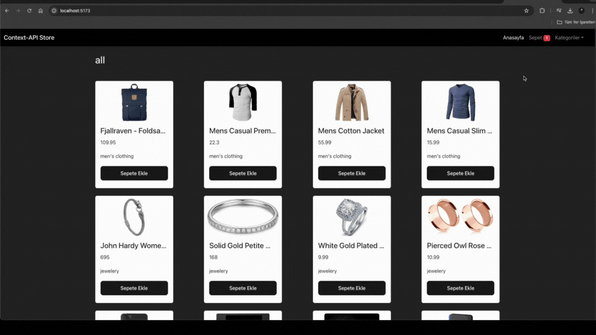

# E-Commerce with React

- This project is a React-based e-commerce application that provides an online shopping experience using the FakeStore API. It features data fetching with Axios, state management with React Context API, modern styling with Bootstrap, and user interaction with React Toastify.

## Technologies and Libraries

- ReactJS: Used to build a user-friendly, component-based interface.
- Axios: For fetching data from the FakeStore API.
- Bootstrap: Provides modern, responsive design with CSS and JS integration.
- Context API: Manages the product and cart states efficiently.
- Toastify: Displays notifications to enhance user interaction and feedback.

## Project Features

- Responsive Design: The project is optimized for all devices, ensuring a seamless browsing experience on mobile, tablet, and desktop.
- Product Listing: Dynamically fetched products from the FakeStore API.
- Cart Management: Users can add or remove products, and view the cart's status in real-time.
- Bootstrap Design: Offers a sleek and intuitive user interface.

## GIF

